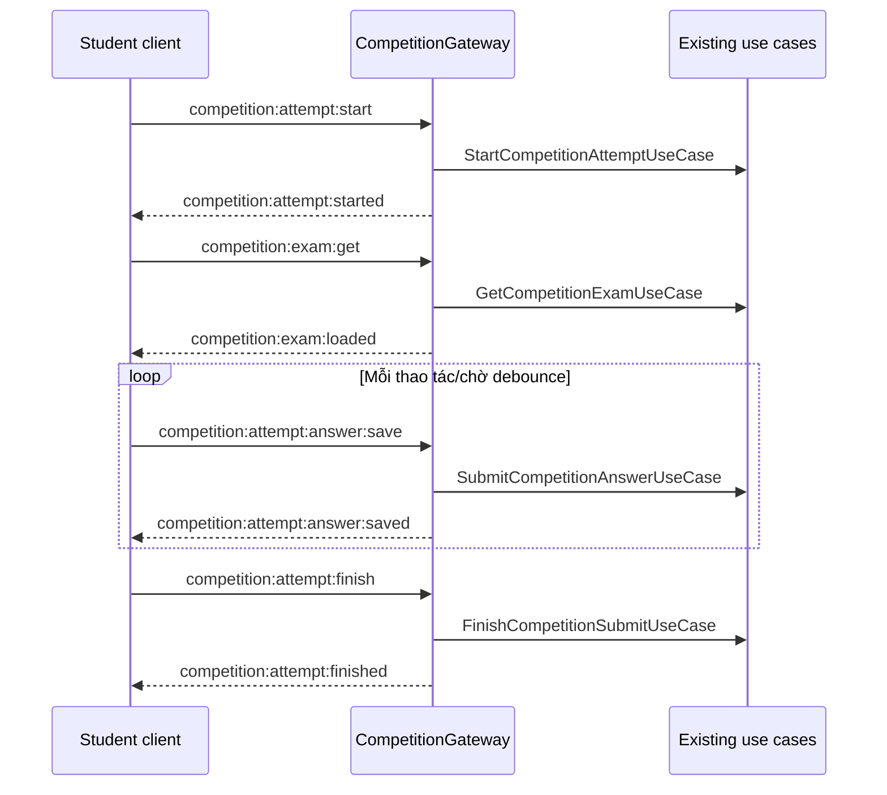

# Competition Gateway — Socket Event Contract

## Phạm vi

`CompetitionGateway` phục vụ riêng luồng học sinh làm bài. Gateway không có room `competition:<competitionId>`, không phát event cho admin và không có leaderboard realtime.

Mọi dữ liệu riêng tư chỉ đi theo một trong hai room sau:

| Room | Ai tham gia | Dùng để |
| --- | --- | --- |
| `user:<userId>` | BaseGateway tự join khi JWT handshake hợp lệ | Phát kết quả nộp bài đến tất cả tab/thiết bị của chính học sinh. |
| `competition-submit:<submitId>` | Tab đã start hoặc subscribe lượt làm bài đó | Đồng bộ đáp án giữa các tab đang mở cùng một lượt làm bài. |

`BaseGateway` vẫn xác thực JWT từ handshake và lấy `studentId` từ `client.data.user`. Client không gửi `studentId` trong bất kỳ event nào.

## Ký hiệu chiều event

- `C → S`: client gửi command vào server.
- `S → C`: server phát kết quả/event về client.
- Khi lỗi, server phát event sẵn có `error` với `{ message, code, timestamp }`.

## Luồng tổng quát



## Event chi tiết

### 1. Bắt đầu hoặc tiếp tục lượt làm bài

| Thuộc tính | Giá trị |
| --- | --- |
| Chiều | `C → S` |
| Input event | `competition:attempt:start` |
| Mục đích | Tạo lượt `IN_PROGRESS`, hoặc trả lại lượt đang làm dở còn hiệu lực. Sau khi thành công, socket join `competition-submit:<submitId>`. |
| Use case | `StartCompetitionAttemptUseCase` |

```ts
// input
{ competitionId: number }

// output: S → C, competition:attempt:started
{
  success: true
  attempt: {
    competitionSubmitId: number
    competitionId: number
    studentId: number
    attemptNumber: number
    status: 'IN_PROGRESS'
    startedAt?: string
  }
  timestamp: string
}
```

Khi thất bại, server phát `error`:

```ts
{ message: string; code: string; timestamp: string }
```

| Code | Khi nào xảy ra |
| --- | --- |
| `STUDENT_REQUIRED` | Socket không gắn với học sinh hợp lệ. |
| `COMPETITION_NOT_STARTED` | Chưa đến `startDate` của cuộc thi. |
| `COMPETITION_ENDED` | Đã qua `endDate`; không thể bắt đầu hoặc tiếp tục một lượt bằng event này. |
| `ATTEMPT_TIME_EXPIRED` | Có lượt `IN_PROGRESS` nhưng đã vượt `durationMinutes`. Client phải chuyển sang luồng nộp bài. |
| `MAX_ATTEMPTS_REACHED` | Đã dùng hết số lượt làm được phép. |
| `ATTEMPT_START_FAILED` | Lỗi không được phân loại (bao gồm dữ liệu đầu vào không hợp lệ). |

`durationMinutes: null` (hoặc không có giá trị) nghĩa là lượt làm **không giới hạn thời gian**. Trong trường hợp này server không phát `ATTEMPT_TIME_EXPIRED`; event `competition:attempt:start` trả lại lượt `IN_PROGRESS` hiện có.

### 2. Tải đề thi

| Thuộc tính | Giá trị |
| --- | --- |
| Chiều | `C → S` |
| Input event | `competition:exam:get` |
| Mục đích | Tải đề, section, question và statement; tuyệt đối không gửi đáp án đúng/solution. |
| Use case | `GetCompetitionExamUseCase` |

```ts
// input
{ competitionId: number }

// output: S → C, competition:exam:loaded
{
  success: true
  exam: {
    competition: { competitionId: number; title: string; durationMinutes?: number }
    exam: { examId: number; sections: unknown[]; questions: unknown[]; totalQuestions: number }
  }
  timestamp: string
}
```

Lỗi: `STUDENT_REQUIRED`, `EXAM_LOAD_FAILED`.

### 3. Subscribe một lượt làm bài đang có

| Thuộc tính | Giá trị |
| --- | --- |
| Chiều | `C → S` |
| Input event | `competition:attempt:subscribe` |
| Mục đích | Dùng khi reload/reconnect hoặc mở thêm tab. Server xác minh ownership qua danh sách đáp án, join room riêng của submit, rồi trả snapshot đáp án và thời gian. |
| Use case | `GetCompetitionAnswersUseCase`, `GetCompetitionRemainingTimeUseCase` |

```ts
// input
{ submitId: number }

// output: S → C, competition:attempt:subscribed
{
  success: true
  submitId: number
  answers: StudentAnswerDto[]
  time: { remainingSeconds: number; isOverTime: boolean; formattedRemaining?: string }
  timestamp: string
}
```

Lỗi: `STUDENT_REQUIRED`, `ATTEMPT_SUBSCRIBE_FAILED`.

### 4. Lưu đáp án

| Thuộc tính | Giá trị |
| --- | --- |
| Chiều | `C → S`, sau đó `S → competition-submit:<submitId>` |
| Input event | `competition:attempt:answer:save` |
| Mục đích | Lưu/upsert đáp án của một câu hỏi. Event output được phát vào room riêng của submit để các tab cùng lượt làm bài đồng bộ. |
| Use case | `SubmitCompetitionAnswerUseCase` |

```ts
// input — trường phù hợp với loại câu hỏi
{
  submitId: number
  answerId: number
  answer?: string                         // SHORT_ANSWER, ESSAY
  selectedStatementIds?: number[]         // SINGLE_CHOICE, MULTIPLE_CHOICE
  trueFalseAnswers?: Array<{ statementId: number; isTrue: boolean | null }>
  timeSpentSeconds?: number
}

// output: S → C, competition:attempt:answer:saved
{
  success: true
  submitId: number
  answerId: number
  answer: unknown                         // output hiện có của use case
  timestamp: string
}
```

Lỗi: `STUDENT_REQUIRED`, `ANSWER_SAVE_FAILED`.

### 5. Đồng bộ thời gian còn lại

| Thuộc tính | Giá trị |
| --- | --- |
| Chiều | `C → S`, sau đó `S → C` |
| Input event | `competition:attempt:time:get` |
| Mục đích | Frontend lấy thời gian server-authoritative khi mở lại tab, reconnect hoặc cần hiệu chỉnh countdown cục bộ. |
| Use case | `GetCompetitionAnswersUseCase` để xác minh owner, sau đó `GetCompetitionRemainingTimeUseCase` |

```ts
// input
{ submitId: number }

// output: S → C, competition:attempt:time:sync
{
  success: true
  submitId: number
  time: { remainingSeconds: number; isOverTime: boolean; formattedRemaining?: string }
  timestamp: string
}
```

Lỗi: `STUDENT_REQUIRED`, `TIME_GET_FAILED`.

### 6. Nộp bài

| Thuộc tính | Giá trị |
| --- | --- |
| Chiều | `C → S`, sau đó `S → user:<userId>` |
| Input event | `competition:attempt:finish` |
| Mục đích | Chấm các đáp án có thể tự chấm, đổi trạng thái lượt làm bài và phát kết quả riêng tư tới tất cả tab của học sinh. Không phát ra bất kỳ room competition chung nào. |
| Use case | `FinishCompetitionSubmitUseCase` |

```ts
// input
{ submitId: number; homeworkContentId?: number }

// output: S → C, competition:attempt:finished
{
  success: true
  result: {
    competitionSubmitId: number
    competitionId: number
    status: 'SUBMITTED' | 'GRADED'
    submittedAt: string
    allowViewScore: boolean
    totalPoints: number | null
    maxPoints: number | null
    scorePercentage: number | null
    feedback: string | null
  }
  timestamp: string
}
```

Lượt `IN_PROGRESS` vẫn được nộp ngay cả khi cuộc thi đã qua `endDate` hoặc thời lượng làm bài đã hết. Quy tắc này chỉ áp dụng cho event nộp bài, không áp dụng cho `competition:attempt:start`. Nếu `durationMinutes` là `null`, lượt làm là vô thời hạn và không có khái niệm hết giờ theo lượt làm.

| Code | Khi nào xảy ra |
| --- | --- |
| `STUDENT_REQUIRED` | Socket không gắn với học sinh hợp lệ. |
| `ATTEMPT_ALREADY_SUBMITTED` | Lượt làm đã có trạng thái `SUBMITTED` hoặc `GRADED`; không nộp/chấm lại. |
| `ATTEMPT_NOT_ACTIVE` | Lượt làm không còn ở trạng thái `IN_PROGRESS` (ví dụ: `ABANDONED`). |
| `ATTEMPT_FINISH_FAILED` | Lỗi không được phân loại khi nộp bài. |

## Quy tắc frontend

1. Kết nối Socket với JWT handshake trước khi gọi event competition.
2. Gọi `competition:attempt:start`, sau đó `competition:exam:get`. Khi nhận `ATTEMPT_TIME_EXPIRED`, yêu cầu học sinh nộp bài thay vì tạo lượt mới; khi nhận `COMPETITION_ENDED`, không cho bắt đầu lượt mới.
3. Khi refresh/reconnect, gọi `competition:attempt:subscribe` bằng `submitId` đã lưu cục bộ.
4. Debounce `competition:attempt:answer:save`; chỉ update UI sau event `competition:attempt:answer:saved`.
5. Countdown hiển thị ở client nhưng phải đồng bộ lại bằng `competition:attempt:time:get`; server là nguồn thời gian quyết định.
6. Khi nhận `competition:attempt:finished`, khóa UI làm bài và chuyển sang trang kết quả theo `allowViewScore`. Khi nhận `ATTEMPT_ALREADY_SUBMITTED`, hiển thị thông báo bài đã nộp và chuyển sang trang kết quả/lịch sử.

## Phạm vi chưa triển khai

- Auto-finish khi hết thời gian bằng scheduler/job server.
- Idempotency key (`clientMutationId`) và version (`revision`) cho retry/multi-tab conflict.
- ValidationPipe riêng cho WebSocket payload và rate limit cho event lưu đáp án.
- Dừng/deprecate các endpoint REST ở `DoCompetitionController`.

Các nội dung này nên được thêm sau khi frontend đã chạy ổn định với event contract ở trên.
