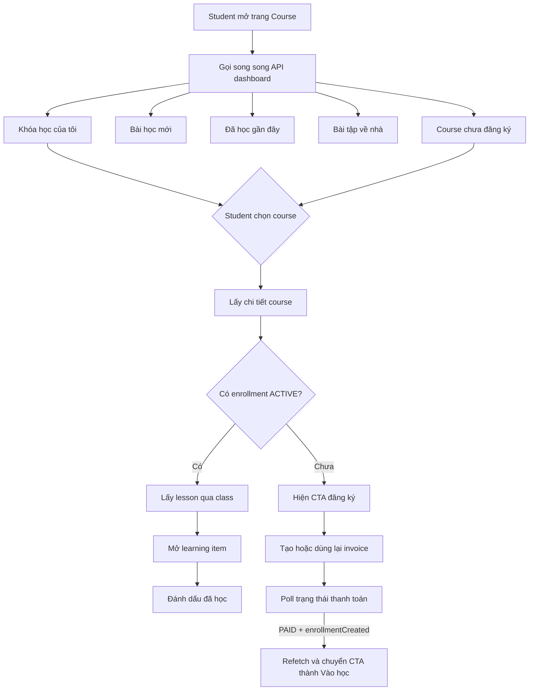

# Course Student Page Flow

Tài liệu này mô tả luồng FE cho trang khóa học của **học sinh đã đăng nhập**.

Contract chi tiết và response mẫu của các API theo dõi học tập nằm tại [FE-STUDENT-COURSE-APIS.md](./FE-STUDENT-COURSE-APIS.md).

## 1. Phạm vi trang

Trang course của student nên có các khu vực:

1. Khóa học của tôi: course đã tham gia, phần trăm hoàn thành, thumbnail và giáo viên.
2. Bài học mới: lesson mới nhất trong các course đang học.
3. Đã học gần đây: learning item đã được đánh dấu hoàn thành.
4. Bài tập về nhà: homework content, hạn nộp và homework submit nếu có.
5. Khám phá khóa học: course online chưa có enrollment `ACTIVE`.
6. Chi tiết course: thông tin course, media, giáo viên, lesson và learning item.
7. Đăng ký khóa học: tạo invoice, chờ thanh toán và chuyển sang trạng thái “Vào học”.

## 2. Auth và rule backend

Mọi API student phải gửi:

```http
Authorization: Bearer <student_access_token>
```

FE không gửi `studentId`. Backend lấy `userId` và `studentId` từ JWT.

Các rule quan trọng:

- Course của student không trả course `DRAFT`.
- Nội dung học yêu cầu enrollment `ACTIVE`.
- Lesson phải có `visibility = PUBLISHED`.
- Lesson và learning item đều đi qua quyền xem theo class.
- FE không tự suy luận quyền xem từ `classId`; dữ liệu backend trả về là nguồn cuối cùng.
- Media và avatar sử dụng presigned URL, FE phải xử lý trường hợp URL hết hạn bằng cách refetch API.

### Quyền xem lesson qua class

Backend dùng `StudentClassLessonAccessService`:

- Student chưa được xếp class trong course: vẫn thấy lesson `PUBLISHED`.
- Lesson chưa cấu hình cho class của student: vẫn được hiển thị.
- Khi tất cả class của student đã cấu hình lesson, lesson chỉ hiển thị nếu có ít nhất một cấu hình thỏa `isVisible`, `availableFrom` và `availableUntil`.

## 3. Bản đồ API

| Nhu cầu | API |
| --- | --- |
| Course đã tham gia | `GET /api/course-enrollments/student/my` |
| Course đã tham gia, sắp xếp theo tiến độ | `GET /api/course-enrollments/student/my/by-progress` |
| Course online chưa tham gia | `GET /api/courses/student/online-not-enrolled` |
| Chi tiết course cho student | `GET /api/courses/student/:courseId` |
| Lesson mới nhất | `GET /api/lessons/student/latest` |
| Lesson được xem trong course | `GET /api/lessons/student/course/:courseId` |
| Chi tiết lesson | `GET /api/lessons/:lessonId/student` |
| Learning item của lesson | `GET /api/lesson-learning-items/student/lesson/:lessonId` |
| Chi tiết learning item | `GET /api/learning-items/:learningItemId/student` |
| Learning item đã học | `GET /api/lesson-learning-items/student/learned` |
| Đánh dấu đã học | `POST /api/student-learning-items/:learningItemId/mark-learned` |
| Bài tập về nhà | `GET /api/learning-items/student/my-homeworks` |
| Tạo invoice khi đã đăng nhập | `POST /api/courses/public/seo/:courseIdOrCode/register-manual-invoice/me` |
| Kiểm tra thanh toán | `GET /api/online-course-invoices/:invoiceId/payment-status` |

## 4. Luồng tổng thể



## 5. Khởi tạo trang tổng quan

Sau khi có JWT, FE gọi song song:

```http
GET /api/course-enrollments/student/my?page=1&limit=10
GET /api/lessons/student/latest?page=1&limit=10
GET /api/lesson-learning-items/student/learned?page=1&limit=10
GET /api/learning-items/student/my-homeworks?page=1&limit=10&status=ALL
GET /api/courses/student/online-not-enrolled?page=1&limit=12
```

Không để một request lỗi làm mất toàn bộ trang. Mỗi section nên có loading, empty và error state riêng.

### 5.1. Khóa học của tôi

```http
GET /api/course-enrollments/student/my?search=toán&grade=12&subjectId=1&page=1&limit=10
```

Khi cần ưu tiên course theo tiến độ học, dùng endpoint:

```http
GET /api/course-enrollments/student/my/by-progress?search=toán&grade=12&subjectId=1&sortOrder=desc&page=1&limit=10
```

Endpoint này giữ nguyên filter và response của `/student/my`, nhưng luôn sắp xếp
theo `completionPercentage` trên toàn bộ kết quả trước khi phân trang:

- `sortOrder=desc` (mặc định): tiến độ cao đến thấp.
- `sortOrder=asc`: tiến độ thấp đến cao.
- Không cần truyền `sortBy`; nếu truyền thì backend cũng bỏ qua.

Query chính:

| Query | Ý nghĩa |
| --- | --- |
| `search` | Tìm theo tên course hoặc thông tin học sinh |
| `grade` | Lọc khối từ 1 đến 12 |
| `subjectId` | Lọc theo môn |
| `status` | Lọc trạng thái enrollment |
| `page`, `limit` | Phân trang |
| `sortBy`, `sortOrder` | Sắp xếp |

Mỗi item có:

- Enrollment: `enrollmentId`, `status`, `enrolledAt`.
- Course: `courseId`, `code`, `title`, grade, subject và pricing.
- Tiến độ: `completionPercentage`.
- Ảnh: `thumbnail`.
- Giáo viên: `teacherName`, `teacherAvatarUrl`; trong `course.teacher` cũng có `avatarUrl`.

CTA đề xuất:

- `ACTIVE`: “Vào học”.
- `COMPLETED`: “Xem lại”.
- Trạng thái khác: hiển thị theo `statusDisplay` và rule sản phẩm.

### 5.2. Bài học mới

```http
GET /api/lessons/student/latest?page=1&limit=10
```

API chỉ lấy lesson thuộc enrollment `ACTIVE`, đã `PUBLISHED` và student được xem qua class. Mỗi lesson có:

- `courseId`, `courseName`.
- `learningItems[]` kèm `isLearned`, `learnedAt`.
- `totalLearningItems`, `completedLearningItems`, `completionPercentage`.

FE dùng `completionPercentage` cho progress bar và điều hướng bằng `courseId`, `lessonId`.

### 5.3. Learning item đã học

```http
GET /api/lesson-learning-items/student/learned?page=1&limit=10
```

Mỗi item chỉ xuất hiện một lần và có:

- `isLearned = true`, `learnedAt`.
- Thông tin learning item.
- `lessons[]` chỉ gồm lesson/course student được phép xem.

Khi bấm item, FE gọi:

```http
GET /api/learning-items/:learningItemId/student
```

### 5.4. Bài tập về nhà

```http
GET /api/learning-items/student/my-homeworks?status=ALL&page=1&limit=10
```

Hỗ trợ:

- `status=ALL|INCOMPLETE|COMPLETED|OVERDUE`.
- `INCOMPLETE`: chưa có homework submit; `COMPLETED`: đã có homework submit.
- `OVERDUE`: `FILE_UPLOAD` xét deadline homework; `COMPETITION` xét cả deadline homework và competition, một trong hai hết hạn là overdue.
- Deadline `null` nghĩa là vô thời hạn.
- `search`, `courseId`, `lessonId`.
- `homeworkType=COMPETITION|FILE_UPLOAD`.
- `sortBy`, `sortOrder`.

Mỗi learning item có `homeworkContents[]`. Mỗi content có:

- Nội dung, loại bài, deadline và rule nộp muộn.
- `isSubmitted`, `isOverdue`, `points`, `feedback`.
- `homeworkSubmit` nếu student đã nộp.

### 5.5. Course online chưa đăng ký

```http
GET /api/courses/student/online-not-enrolled?search=toán&grade=12&subjectId=1&page=1&limit=12
```

Backend luôn ép:

- `visibility = PUBLISHED`.
- `isEnded = false`.
- `courseType` là `ONLINE` hoặc `ALL`.
- Không có enrollment `ACTIVE` của student hiện tại.

Mỗi course có `thumbnail`, `teacherName`, `teacherAvatarUrl` và `teacher.avatarUrl` nếu media sẵn sàng.

## 6. Luồng chi tiết course

Khi student chọn một course từ bất kỳ section nào:

```http
GET /api/courses/student/:courseId
```

Response chính:

- Thông tin course, subject, pricing và trạng thái enrollment.
- `media.thumbnail`, `media.banner`, `media.introVideo`, `media.gallery`.
- `teacherName`, `teacherFirstName`, `teacherLastName`, `teacherEmail`, `teacherAvatarUrl`.
- `isEnrolled`, `enrollmentStatus`, `isPaidFull`.

FE xác định CTA:

```ts
if (course.isEnrolled && course.enrollmentStatus === 'ACTIVE') {
  action = 'Vào học'
} else if (course.courseType === 'ONLINE' || course.courseType === 'ALL') {
  action = course.isFree ? 'Đăng ký miễn phí' : 'Đăng ký khóa học'
}
```

Không dùng `GET /courses/public/seo/:courseIdOrCode` cho màn hình student nếu chỉ cần contract student. API public SEO dành cho visitor/crawler và preview public.

## 7. Luồng học course đã tham gia

### 7.1. Lấy lesson trong course

```http
GET /api/lessons/student/course/:courseId
```

Response đã được lọc qua class và có tiến độ từng lesson. FE không gọi API admin lesson.

### 7.2. Mở lesson

```http
GET /api/lessons/:lessonId/student
GET /api/lesson-learning-items/student/lesson/:lessonId
```

Có thể gọi song song hai API nếu màn hình cần cả metadata lesson và danh sách item.

### 7.3. Mở learning item

```http
GET /api/learning-items/:learningItemId/student
```

Backend trả content theo type:

| Type | Nội dung chính |
| --- | --- |
| `VIDEO` | `videoContents`, URL stream |
| `DOCUMENT` | `documentContents`, media files |
| `YOUTUBE` | `youtubeContents`, YouTube URL |
| `HOMEWORK` | `homeworkContents`, progress và submission |

### 7.4. Đánh dấu đã học

Sau khi student hoàn thành video/document/youtube theo rule FE:

```http
POST /api/student-learning-items/:learningItemId/mark-learned
```

Không cần body. API idempotent: nếu đã học thì giữ `learnedAt` hiện tại.

Sau khi thành công, cập nhật optimistic UI hoặc refetch:

- Lesson hiện tại.
- Danh sách lesson của course.
- Lesson mới nhất.
- Learning item đã học.
- Enrollment progress.

## 8. Luồng đăng ký course

### 8.1. Tạo hoặc lấy lại invoice

```http
POST /api/courses/public/seo/:courseIdOrCode/register-manual-invoice/me
Authorization: Bearer <student_access_token>
```

Body không cần truyền.

Backend xử lý:

- Đã có enrollment `ACTIVE`: không tạo invoice mới.
- Đã có invoice `PENDING_PAYMENT`: trả lại invoice cũ với `reusedPendingInvoice=true`.
- Course miễn phí: invoice được đánh dấu `PAID` và tạo enrollment ngay.
- Course có phí: tạo invoice `PENDING_PAYMENT` với provider `BANK_TRANSFER`.

FE lưu `invoiceId` từ response.

### 8.2. Theo dõi thanh toán

```http
GET /api/online-course-invoices/:invoiceId/payment-status
Authorization: Bearer <student_access_token>
```

Chỉ poll khi invoice đang chờ thanh toán. Khoảng poll đề xuất: 3–5 giây.

Khi:

```text
status = PAID
enrollmentCreated = true
```

FE phải:

1. Dừng poll.
2. Hiện thông báo thành công.
3. Refetch `course-enrollments/student/my`.
4. Refetch `courses/student/online-not-enrolled`.
5. Refetch chi tiết course.
6. Đổi CTA thành “Vào học”.

Nếu course miễn phí và response tạo invoice đã là `PAID`, không cần poll.

## 9. Query key và cache đề xuất

```ts
const courseKeys = {
  enrollments: (params: object) => ['student-course-enrollments', params],
  available: (params: object) => ['student-available-courses', params],
  detail: (courseId: number) => ['student-course-detail', courseId],
  lessons: (courseId: number) => ['student-course-lessons', courseId],
  latestLessons: (params: object) => ['student-latest-lessons', params],
  learnedItems: (params: object) => ['student-learned-items', params],
  homeworks: (params: object) => ['student-homeworks', params],
  learningItem: (learningItemId: number) => ['student-learning-item', learningItemId],
}
```

Không cache presigned URL lâu hơn `expirySeconds`. Khi ảnh/video trả 401/403 do URL hết hạn, refetch query chứa URL đó.

## 10. Axios mẫu

```ts
const authConfig = (token: string) => ({
  headers: { Authorization: `Bearer ${token}` },
})

export async function getStudentCourseDashboard(token: string) {
  const config = authConfig(token)

  const [enrollments, latestLessons, learnedItems, homeworks, availableCourses] =
    await Promise.allSettled([
      axios.get('/api/course-enrollments/student/my', config),
      axios.get('/api/lessons/student/latest', config),
      axios.get('/api/lesson-learning-items/student/learned', config),
      axios.get('/api/learning-items/student/my-homeworks', config),
      axios.get('/api/courses/student/online-not-enrolled', config),
    ])

  return { enrollments, latestLessons, learnedItems, homeworks, availableCourses }
}

export async function openStudentCourse(courseId: number, token: string) {
  const config = authConfig(token)
  const course = await axios.get(`/api/courses/student/${courseId}`, config)

  if (course.data.data.isEnrolled) {
    const lessons = await axios.get(`/api/lessons/student/course/${courseId}`, config)
    return { course: course.data, lessons: lessons.data }
  }

  return { course: course.data, lessons: null }
}
```

## 11. Empty và error state

| Trường hợp | FE xử lý |
| --- | --- |
| Enrollment `data=[]` | Hiện CTA khám phá khóa học |
| Latest lesson `data=[]` | Hiện “Chưa có bài học mới” |
| Learned item `data=[]` | Hiện “Bạn chưa hoàn thành mục học tập nào” |
| Homework `data=[]` | Hiện “Không có bài tập” |
| Available course `data=[]` | Hiện “Không còn khóa học phù hợp” |
| `401` | Refresh token hoặc chuyển về đăng nhập |
| `403/404` khi mở lesson/item | Nội dung không còn khả dụng theo enrollment/class; quay về danh sách course |
| Presigned URL hết hạn | Refetch API tạo URL |

## 12. Checklist FE

- Luôn gửi JWT, không gửi `studentId`.
- Dùng API student cho detail, lesson và learning item.
- Không hiển thị lesson từ cache sau khi backend trả 403/404.
- Dùng `completionPercentage` từ backend.
- Sau `mark-learned`, invalidate toàn bộ progress liên quan.
- Sau thanh toán thành công, invalidate enrollment và danh sách course chưa đăng ký.
- Có fallback khi thiếu thumbnail hoặc avatar giáo viên.
- Không lưu presigned URL như URL vĩnh viễn.
